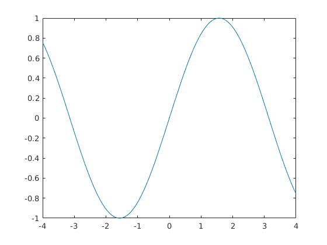
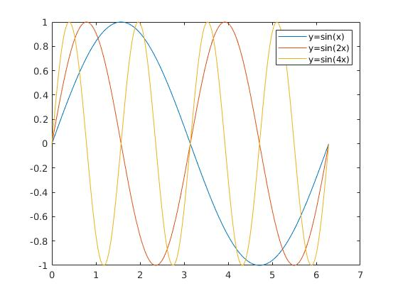
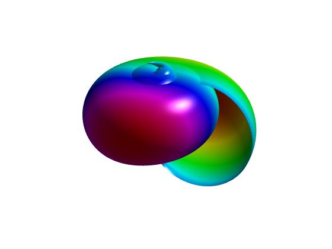
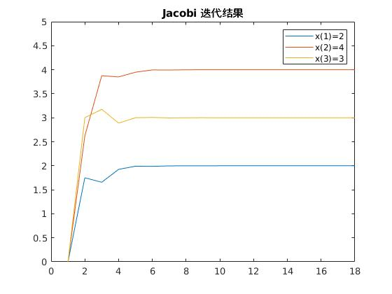

# Matlab 基础


MATLAB（矩阵实验室）是 MATrix LABoratory 的缩写，是一款由美国 The MathWorks 公司
出品的商业数学软件。MATLAB 是一种用于算法开发、数据可视化、数据分析以及数值计算
的高级技术计算语言和交互式环境。除了矩阵运算、绘制函数/数据图像等常用功能外，
MATLAB 还可以用来创建用户界面及与调用其它语言（包括C、C++、Java、Python 和 FORTRAN
）编写的程序。

尽管MATLAB主要用于数值运算，但利用为数众多的附加工具箱（Toolbox）它也适合不同领
域的应用，例如控制系统设计与分析、图像处理、信号处理与通讯、金融建模和分析等。另
外还有一个配套软件包Simulink，提供一个可视化开发环境，常用于系统模拟、动态/嵌入
式系统开发等方面。


## Matlab 语法基础

### 变量（Variables)

```
>> x = 17
x =
 17

>> x = 'hat'
x =
hat

>> x = [3*4, pi/2]
x =
 12.0000 1.5708

>> y = 3*sin (x)
y =
   -1.6097 3.0000
```

* 动态类型的语言

### 向量与矩阵 （Vectors and matrices)

* **冒号语法**：  `start:step:stop`

定义一个行向量

```
>> a = 1:2:9

a =

     1     3     5     7     9
```

```
>> a = 1:3:9

a =

     1     4     7
```

* **中括号语法**


下面定义一个矩阵 `A`， 空格或逗号隔开同一行的元素， 分号隔开不同行的元素

```
>> A = [16 3 2 13; 5 10 11 8; 9 6 7 12; 4 15 14 1]

A =

    16     3     2    13
     5    10    11     8
     9     6     7    12
     4    15    14     1
```

并访问第 2 行和第 3 列的元素。
```
>> A(2, 3)

ans =

    11
```

用冒号语法访问**子矩阵**

```
>> A(2:4,3:4)   

ans =

    11     8
     7    12
    14     1

```

* **常见矩阵的生成**

```
>> eye(3, 3)

ans =

     1     0     0
     0     1     0
     0     0     1

>> zeros(2, 3)

ans =

     0     0     0
     0     0     0

>> ones(2, 3)

ans =

     1     1     1
     1     1     1

```


* **数组算术运算符**

<div class="table-responsive"><table class="table table-condensed"><colgroup><col class="tcol1" width="17%"><col class="tcol2" width="18%"><col class="tcol3" width="50%"><col class="tcol4" width="16%"></colgroup><thead><tr><th><p>运算符</p></th><th><p>用途</p></th><th><p>说明</p></th><th><p>参考页</p></th></tr></thead><tbody><tr><td><p><code class="literal">+</code></p></td><td><p>加法</p></td><td><p><code class="literal">A+B</code> 表示将 <code class="literal">A</code> 和 <code class="literal">B</code> 加在一起。</p></td><td><a href="https://ww2.mathworks.cn/help/matlab/ref/plus.html"><code class="function">plus</code></a></td></tr><tr><td><p><code class="literal">+</code></p></td><td><p>一元加法</p></td><td><p><code class="literal">+A</code> 表示返回 <code class="literal">A</code>。</p></td><td><a href="https://ww2.mathworks.cn/help/matlab/ref/uplus.html"><code class="function">uplus</code></a></td></tr><tr><td><p><code class="literal remove_text_wrapping">-</code></p></td><td><p>减法</p></td><td><p><code class="literal">A-B</code> 表示从 <code class="literal">A</code> 中减去 <code class="literal">B</code></p></td><td><a href="https://ww2.mathworks.cn/help/matlab/ref/minus.html"><code class="function">minus</code></a></td></tr><tr><td><p><code class="literal remove_text_wrapping">-</code></p></td><td><p>一元减法</p></td><td><p><code class="literal remove_text_wrapping">-A</code> 表示对 <code class="literal">A</code> 的元素求反。</p></td><td><a href="https://ww2.mathworks.cn/help/matlab/ref/uminus.html"><code class="function">uminus</code></a></td></tr><tr><td><p><code class="literal">.*</code></p></td><td><p>按元素乘法</p></td><td><p><code class="literal">A.*B</code> 表示 <code class="literal">A</code> 和 <code class="literal">B</code> 的逐元素乘积。</p></td><td><a href="https://ww2.mathworks.cn/help/matlab/ref/times.html"><code class="function">times</code></a></td></tr><tr><td><p><code class="literal">.^</code></p></td><td><p>按元素求幂</p></td><td><p><code class="literal">A.^B</code> 表示包含元素 <code class="literal">A(i,j)</code> 的 <code class="literal">B(i,j)</code> 次幂的矩阵。</p></td><td><a href="https://ww2.mathworks.cn/help/matlab/ref/power.html"><code class="function">power</code></a></td></tr><tr><td><code class="literal">./</code></td><td><p>数组右除</p></td><td><p><code class="literal">A./B</code> 表示包含元素 <code class="literal">A(i,j)/B(i,j)</code> 的矩阵。</p></td><td><a href="https://ww2.mathworks.cn/help/matlab/ref/rdivide.html"><code class="function">rdivide</code></a></td></tr><tr><td><p><code class="literal">.\</code></p></td><td><p>数组左除</p></td><td><p><code class="literal">A.\B</code> 表示包含元素 <code class="literal">B(i,j)/A(i,j)</code> 的矩阵。</p></td><td><a href="https://ww2.mathworks.cn/help/matlab/ref/ldivide.html"><code class="function">ldivide</code></a></td></tr><tr><td><p><code class="literal">.'</code></p></td><td><p>数组转置</p></td><td><p><code class="literal">A.'</code> 表示 <code class="literal">A</code> 的数组转置。对于复矩阵，这不涉及共轭。</p></td><td><a href="https://ww2.mathworks.cn/help/matlab/ref/transpose.html"><code class="function">transpose</code></a></td></tr></tbody></table></div>

* **矩阵算术运算符**

<div class="table-responsive"><table class="table table-condensed"><colgroup><col class="tcol1" width="17%"><col class="tcol2" width="17%"><col class="tcol3" width="50%"><col class="tcol4" width="16%"></colgroup><thead><tr><th><p>运算符</p></th><th><p>用途</p></th><th><p>说明</p></th><th><p>参考页</p></th></tr></thead><tbody><tr><td><p><code class="literal">*</code></p></td><td><p>矩阵乘法</p></td><td><p><code class="literal">C =</code> <code class="literal">A*B</code> 表示矩阵 <code class="literal">A</code> 和 <code class="literal">B</code> 的线性代数乘积。<code class="literal">A</code> 的列数必须与 <code class="literal">B</code> 的行数相等。</p></td><td><a href="https://ww2.mathworks.cn/help/matlab/ref/mtimes.html"><code class="function">mtimes</code></a></td></tr><tr><td><p><code class="literal">\</code></p></td><td><p>矩阵左除</p></td><td><p><code class="literal">x = A\B</code> 是方程 Ax = B 的解。矩阵 <code class="literal">A</code> 和 <code class="literal">B</code> 必须拥有相同的行数。</p></td><td><a href="https://ww2.mathworks.cn/help/matlab/ref/mldivide.html"><code class="function">mldivide</code></a></td></tr><tr><td><p><code class="literal">/</code></p></td><td><p>矩阵右除</p></td><td><p><code class="literal">x = B/A</code> 是方程 xA = B 的解。矩阵 <code class="literal">A</code> 和 <code class="literal">B</code> 必须拥有相同的列数。用左除运算符表示的话，<code class="literal">B/A
= (A'\B')'</code>。 </p></td><td><a href="https://ww2.mathworks.cn/help/matlab/ref/mrdivide.html"><code class="function">mrdivide</code></a></td></tr><tr><td><p><code class="literal">^</code></p></td><td><p>矩阵幂</p></td><td><p><code class="literal">A^B</code> 表示 <code class="literal">A</code> 的 <code class="literal">B</code> 次幂（如果 <code class="literal">B</code> 为标量）。对于 <code class="literal">B</code> 的其他值，计算包含特征值和特征向量。</p></td><td><a href="https://ww2.mathworks.cn/help/matlab/ref/mpower.html"><code class="function">mpower</code></a></td></tr><tr><td><p><code class="literal">'</code></p></td><td><p>复共轭转置</p></td><td><p><code class="literal">A'</code> 表示 <code class="literal">A</code> 的线性代数转置。对于复矩阵，这是复共轭转置。 </p></td><td><a href="https://ww2.mathworks.cn/help/matlab/ref/ctranspose.html"><code class="function">ctranspose</code></a></td></tr></tbody></table></div>


### 画图 

画一条曲线

```
>> x = -4:0.05:4;
>> y = sin(x);
>> plot(x, y)
```



```
>> x = 0:.01:2*pi;
>> y1 = sin(x);
>> y2 = sin(2*x);
>> y3 = sin(4*x);
>> plot(x, [y1; y2; y3])
>> legend('y=sin(x)', 'y=sin(2x)','y=sin(4x)')
```



```
>> t = linspace(0, 2*pi, 512);
>> [u,v] = meshgrid(t);
>> a = -0.4; b = .5; c = .1;
>> n = 3;
>> x = (a*(1 - v/(2*pi)) .*(1+cos(u)) + c) .* cos(n*v);
>> y = (a*(1 - v/(2*pi)) .*(1+cos(u)) + c) .* sin(n*v);
>> z = b*v/(2*pi) + a*(1 - v/(2*pi)) .* sin(u);
>> surf(x,y,z,y)
>> axis off
>> axis equal
>> colormap(hsv(1024))
>> shading interp
>> material shiny
>> lighting phong
>> camlight('left', 'infinite')
>> view([-160 25])
```



### [向量化操作][vec]

matlab 中的大部分函数都支持输入矩阵向量，即向量化操作

```
i = 0;
for t = 0:.01:10
    i = i + 1;
    y(i) = sin(t);
end
```

```
t = 0:.01:10;
y = sin(t);
```

下面给出矩阵乘法的两种实现的时间对比：

```
dim = 500; 
A = randn(dim); 
B = randn(dim) ; 

tic; 
C = A * B; 
toc; 

tic;
D = zeros(dim, dim); 
for i = 1 : dim
    for j = 1 : dim
        sum = 0;
        for k = 1 : dim
            sum = sum + A (i , k ) * B (k , j );
        end ;
        D(i, j) = sum;
    end 
end 
toc
```
时间结果如下：

```
Elapsed time is 0.159217 seconds.
Elapsed time is 0.461819 seconds.
```

## 数值实验模板

```
                      Matlab 实验报告

姓名：张三   学号：123456    班级：信计1班   评分：

一、 实验题目

二、 实现算法

三、 程序代码

四、 实验结果与分析

```

### 实验报告范例

<center> 
<h2>Matlab 实验报告 </h2> 
<p>姓名：张三 学号：123456 班级：信计1班 评分：</p>
</center>


**一、题目：** 应用Jacobi迭代法求解如下方程组：

$$ 
\left\{
\begin{aligned}
&4x_1-x_2+x_3=7\\
&4x_1-8x_2+x_3=-21\\
&-2x_1+x_2+5x_3=15
\end{aligned}
\right.
$$

要求计算精度为 $$10^{-7}$$。

**二、实现算法**：对一般的 $$n$$ 阶线性代数方程组
$$
Ax=b,\quad A=(a_{ij})_{n\times n},\quad b=(b_1,b_2,\ldots, b_n)^T
$$

其相应的 Jacobi 迭代算法为：将 $$A$$ 分解为 $$A=D-L-U$$，其中

$$ 
D=diag(a_{11},a_{22},\cdots,a_{nn}),
$$

$$
\begin{aligned}
 L&=-\begin{bmatrix} 0 & 0 & \cdots & 0\\
a_{21} & 0 &  \ddots & \vdots\\
\vdots & \ddots & \ddots & 0\\
a_{n1} & \cdots &  a_{n,n-1} & 0\end{bmatrix},\\ 
U&=-\begin{bmatrix} 0 & a_{12} &  \cdots & a_{1n}\\
0 & 0 & \ddots & \vdots\\
\vdots & \ddots & \ddots  & a_{n-1,n}\\
0 & \cdots & 0  & 0\end{bmatrix}
\end{aligned}
$$

则

$$ 
x=\color{red}{D^{-1}(L+U)}x+\color{blue}{D^{-1}b}
$$

Jacobi 迭代公式为
$$
x^{(k+1)}=\color{red}{B}x^{(k)}+\color{blue}{f}
$$

**三、程序代码：** 

第一步，建立文本文件 `jacobi.m`, 并编写 Jacobi 迭代法函数， 实现如下：

```
function [x,k]=jacobi(A,b,x0,tol)
% jacobi 迭代法, 计算线性方程组的解
% tol 为输入误差容限, 迭代初值x0

    maxit = 300;  

    D=diag(diag(A));  
    L=-tril(A,-1); 
    U=-triu(A,1);
    B=D\(L+U);  
    f=D\b;

    n = length(x0);
    x = zeros(3, 300);
    x(:, 1) = x0;
    x(:, 2) = B*x(:, 1) + f;

    k=2; 
    while ((norm(x(:, k)-x(:, k-1))>=tol)&&(k<maxit))
        k = k + 1;
        x(:, k) =B*x(:, k-1) + f;  
    end
    x = x(:, 1:k);
end
```

第二步， 生成测试文件 `test_jacobi.m`， 内容如下：

```
A  = [4 -1 1;4 -8 1;-2 1 5];
b  = [7 -21 15]';
x0 = [0 0 0]';
tol = 1e-7;
x = jacobi(A, b, x0, 1e-7);
% 打印迭代结果
fprintf('      x(1)             x(2)            x(3)\n');
fprintf('%12.8e   %12.8e    %12.8e\n', x);

% 画图
plot(1:k, x)
legend('x(1)=2', 'x(2)=4', 'x(3)=3')
ylim([0, 5])
title('Jacobi 迭代结果')
```

**四、实验结果与分析** 

在命令窗口输入 `test_jacobi`, 回车

```
>> test_jacobi
      x(1)             x(2)            x(3)
0.00000000e+00   0.00000000e+00    0.00000000e+00
1.75000000e+00   2.62500000e+00    3.00000000e+00
1.65625000e+00   3.87500000e+00    3.17500000e+00
1.92500000e+00   3.85000000e+00    2.88750000e+00
1.99062500e+00   3.94843750e+00    3.00000000e+00
1.98710937e+00   3.99531250e+00    3.00656250e+00
1.99718750e+00   3.99437500e+00    2.99578125e+00
1.99964844e+00   3.99806641e+00    3.00000000e+00
1.99951660e+00   3.99982422e+00    3.00024609e+00
1.99989453e+00   3.99978906e+00    2.99984180e+00
1.99998682e+00   3.99992749e+00    3.00000000e+00
1.99998187e+00   3.99999341e+00    3.00000923e+00
1.99999604e+00   3.99999209e+00    2.99999407e+00
1.99999951e+00   3.99999728e+00    3.00000000e+00
1.99999932e+00   3.99999975e+00    3.00000035e+00
1.99999985e+00   3.99999970e+00    2.99999978e+00
1.99999998e+00   3.99999990e+00    3.00000000e+00
1.99999997e+00   3.99999999e+00    3.00000001e+00
```





计算结果表明，Jacobi 方法对于该问题，可以收敛于真解。


## 实验报告题目


在上述 Jacobi 迭代实验基础上, 完成以下实验任务：

1. 下载线性系统 [Ax=b](./data/ls.mat), 用如下命令可把数据导入 Matlab：

```
>> load ls.mat
>> whos
  Name         Size               Bytes  Class     Attributes

  A         4225x4225            351392  double    sparse
  b         4225x1                33800  double
  x         4225x1                33800  double
```

1. 把上述 Jacobi 迭代函数中的 `x1 = B*x0 + f` 语句用 for 循环实现，测量
   计算时间，并与原始代码进行比较。


[vec]: https://ww2.mathworks.cn/help/matlab/matlab_prog/vectorization.html


<div id="container"></div>
<link rel="stylesheet" href="https://cdn.jsdelivr.net/gh/theme-next/theme-next-gitment@1/default.css"/>
<script src="https://cdn.jsdelivr.net/gh/theme-next/theme-next-gitment@1/gitment.browser.js"></script>

<script>
var gitment = new Gitment({
  id: 'window.location.pathname', // 可选。默认为 location.href
  owner: 'weihuayi',
  repo: 'weihuayi.github.io',
  oauth: {
    client_id: '7dd9c9fc3ac45352b55b',
    client_secret: '4e6f74b82a7ac18671c7e9e0d17a1ceb9359a5ad',
  },
})

gitment.render('container')
</script>

